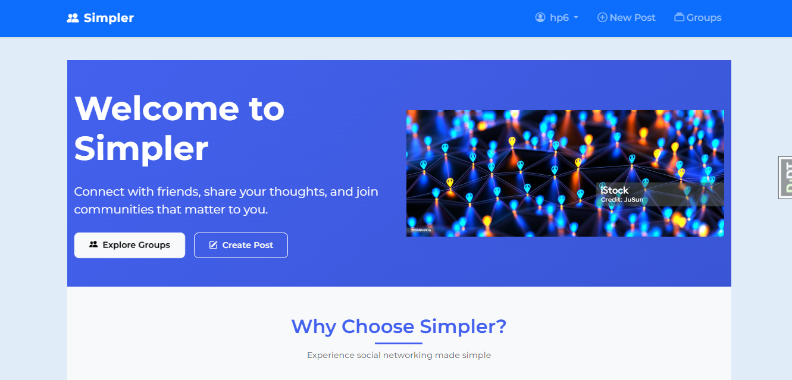
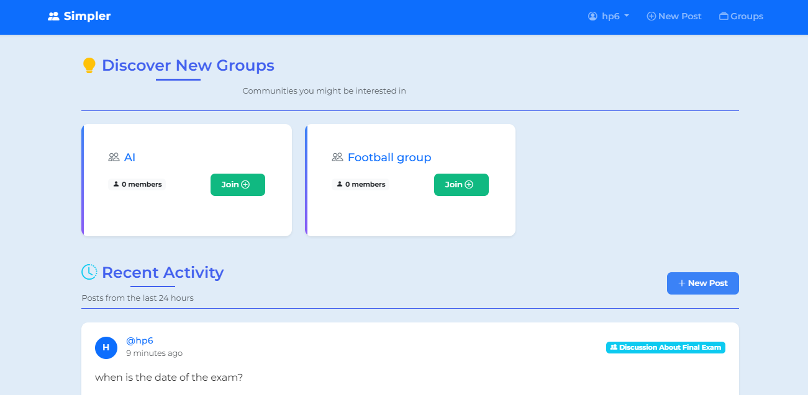
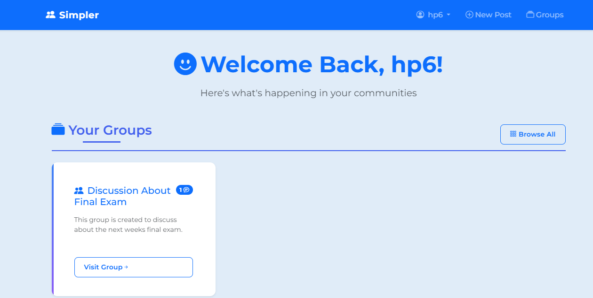
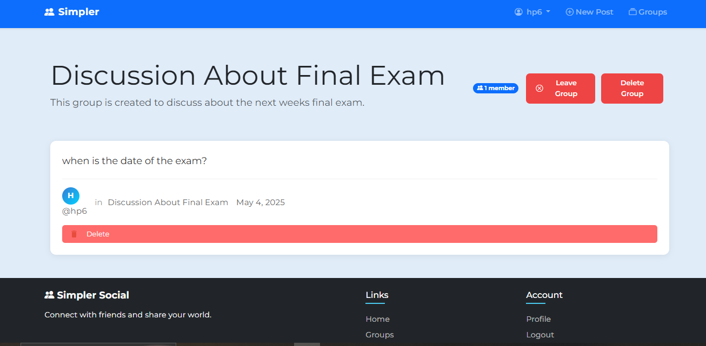

# Simpler 👥  
*A minimalist platform for creating and joining discussion groups*


## Features

### 🔐 User Authentication  
- Secure signup/login  
- Profile management  
- Session persistence  

### 🗨️ Group Discussions  
- Create new discussion groups  
- Join existing groups  
- Leave groups anytime  
- Organized by topics/points  

### 🖥️ Intuitive Interface  
- Clean, responsive design  
- Easy navigation between sections  
- Real-time updates  

## Screenshots  

|  |  |  
|-------------------------------|---------------------------------------|  
| *Homepage with your groups*   | *Browse and join new groups*          |  

|  |  |  
|--------------------------------------------|-------------------------------------|  
| *Manage your active groups*                | *Group discussion interface*        |  

## Tech Stack  

**Frontend**:  
- HTML and CSS 
- Bootstrap 5  

**Backend**:  
- Django 
- SQLite   

## Setup  

1. **Clone repository**  
   ```bash
   git clone https://github.com/DrLeroK/simpler.git